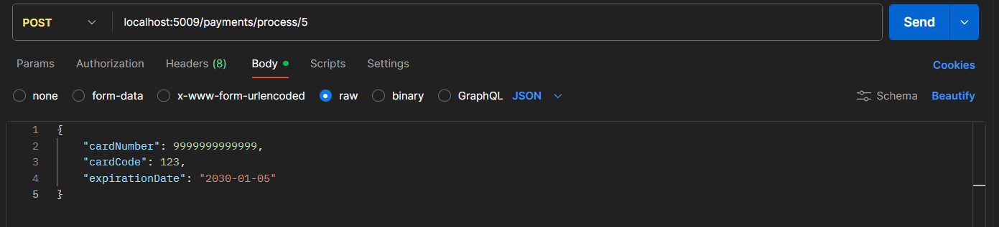

# Labo 04 — Rapport

 \
William Desgagné \
Rapport de laboratoire \
LOG430 — Architecture logicielle \
8 octobre  \
École de technologie supérieure

## Questions

> 💡 **Question 1** : Quelle réponse obtenons-nous à la requête à POST /payments ? Illustrez votre réponse avec des captures d'écran/terminal.

On obtient le payment_id donc dans le font le retour suite au payments 


> 💡 **Question 2** : Quel type d'information envoyons-nous dans la requête à POST payments/process/:id ? Est-ce que ce serait le même format si on communiquait avec un service SOA, par exemple ? Illustrez votre réponse avec des exemples et captures d'écran/terminal.

Nous envoyons des infomrations sous format JSON de maniere classique avec SOA on enverrait sous format xml

Exemple avant on envoyait un json mais ca reste tres libre il n'y a pas de contract entre les services avec
SOA on veux renforcer tout cela on pourrait par exemple encapsuler dans un xml

Avant


Apres typique avec  SOAP
Beaucoup plus securitaire plus fiable
```
POST /PaymentService HTTP/1.1
Content-Type: text/xml; charset=utf-8
SOAPAction: "http://example.com/PaymentService/processPayment"

<soap:Envelope xmlns:soap="http://schemas.xmlsoap.org/soap/envelope/">
  <soap:Body>
    <processPayment xmlns="http://example.com/PaymentService">
      <paymentId>5</paymentId>
      <cardNumber>9999999999999</cardNumber>
      <cvv>123</cvv>
      <expiryDate>2030-01-05</expiryDate>
    </processPayment>
  </soap:Body>
</soap:Envelope>

```


> 💡 **Question 3** : Quel résultat obtenons-nous de la requête à POST payments/process/:id?

On obtient la confirmation du paiment s'il a bien ete payer avec le id de la commande


> 💡 **Question 4** : Quelle méthode avez-vous dû modifier dans log430-a25-labo05-payment et qu'avez-vous modifié ? Justifiez avec un extrait de code.

J'ai du modifier la fonction `update_status_to_paid` car c'est elle qui est appeler lors du process et c'est ici que l'on met a jour le status de paiment donc il suffit d'envoyer un put avec `is_paid` a true
en faisant appelle a notre api-gateway 


Exemple ajout de is_paid a true


> 💡 **Question 5** : À partir de combien de requêtes par minute observez-vous les erreurs 503 ? Justifiez avec des captures d'écran de Locust.

Comme nous avons set le rate limit a 10 par min il est normal de s'attendre a avoir des erreurs tres rapidement en faite l'application laisse passe que 10 requete par min


Ici on voit bien par exemple dans l'exemple que des 8.1 req/s il y a 8 req/s qui fail

Des 1 users il y a deja des erreurs car limiter a 10 par min donc ca donne meme pas une requete par seconde donc finalement ca supporte quasi aucune requete j'ai donc fait des modif pour bien voir en modifiant le fichier et en augment a 10 par seconde et la on voit beaucoup plus que c'est 
a partir de 10 requete par seconde que ca bloque 


> 💡 **Question 6** : Que se passe-t-il dans le navigateur quand vous faites une requête avec un délai supérieur au timeout configuré (5 secondes) ? Quelle est l'importance du timeout dans une architecture de microservices ? Justifiez votre réponse avec des exemples pratiques.

En faite lorsque depasse le delai prevue par notre api gateway ca nous bloque donc erreur 500 sur la requete.

Imaginons que lorsqu’on fait une requête, celle-ci consomme des ressources (threads, connexions, mémoire, etc.).
S’il n’y a pas de timeout, la requête pourrait rester active indéfiniment et continuer à occuper ces ressources.

Maintenant, imaginons que des milliers d’utilisateurs envoient des requêtes qui prennent trop de temps :
les ressources du système (comme les connexions à la base de données) finiraient par être épuisées, ce qui pourrait faire planter complètement l’application.

Le timeout permet donc de libérer ces ressources et de protéger le système avant qu’il ne soit saturé.


## Observations additionnelles

- Utilisation de la VM mais comme j'utilise github un actions runner est utiliser donc je lance mon CI CD en self hosted
